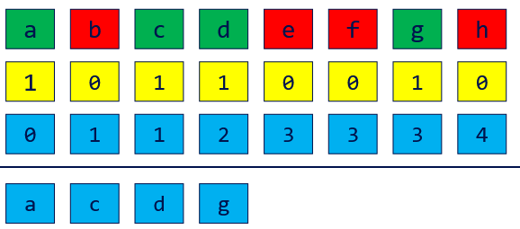
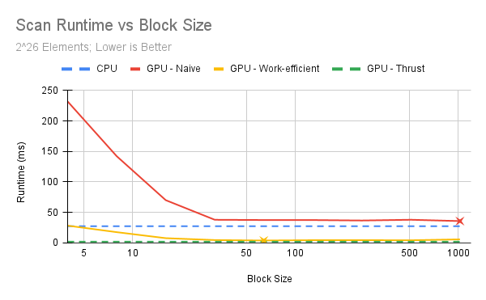
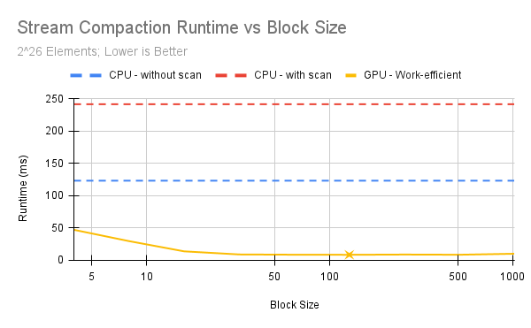
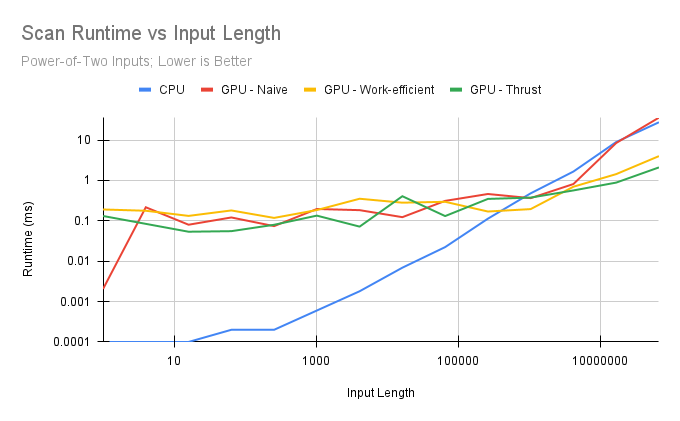
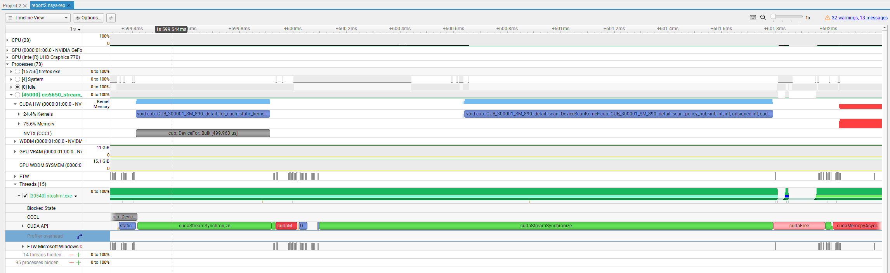
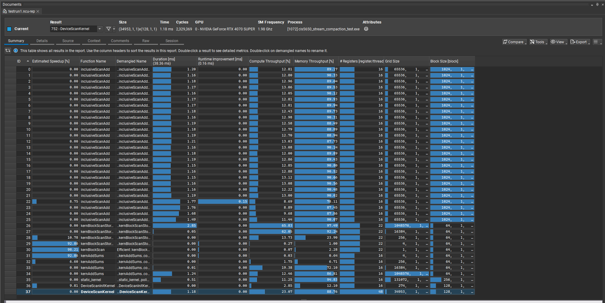

CUDA Stream Compaction
======================

**University of Pennsylvania, CIS 565: GPU Programming and Architecture, Project 2**



* Oliver Hendrych
  * [LinkedIn](https://www.linkedin.com/in/oliver-hendrych/)
* Tested on: Windows 11, i7-14700K @ 3.4GHz 32GB, RTX 4070 SUPER 12GB (Personal)

## Description

This project implements exclusive scan (prefix sum) on the CPU, with a naive GPU implementation, with a work-efficient GPU implementation, and finally by wrapping thrust calls. Leveraging these scan implementations, it also implements stream compaction, which is the process of removing certain (in this case, 0) elements from an array. Stream compaction is achieved through CPU implementations with and without using scan, and a GPU implementation, using the work-efficient scan. All implementations scale to any size of input array, including non-powers of two (efficiently).

The work-efficient GPU implemenation achieves a 6.89x speedup over the CPU implementation at input sizes of 2^26 (3.98858ms vs 27.4916ms).

## Performance

### Block Size

The runtime for various block sizes affecting the GPU implementations are recorded below. CPU and Thrust implementations were averaged and are included for comparison.

#### Runtime (ms) vs Block Size
| Block Size | Scan    |             |                      |              | Compaction         |                 |                      |
|------------|---------|-------------|----------------------|--------------|--------------------|-----------------|----------------------|
| Block Size | CPU     | GPU - Naive | GPU - Work-efficient | GPU - Thrust | CPU - without scan | CPU - with scan | GPU - Work-efficient |
|          4 | 27.4916 |     231.784 |              28.3375 |       2.0969 |            123.318 |         241.689 |              47.2288 |
|          8 | 27.4916 |     142.151 |              17.6827 |       2.0969 |            123.318 |         241.689 |              29.7216 |
|         16 | 27.4916 |     70.1123 |              7.82448 |       2.0969 |            123.318 |         241.689 |              13.8916 |
|         32 | 27.4916 |     37.9731 |               4.7431 |       2.0969 |            123.318 |         241.689 |               9.0921 |
|         64 | 27.4916 |     37.5656 |              3.98858 |       2.0969 |            123.318 |         241.689 |              8.68864 |
|        128 | 27.4916 |      37.524 |              4.54752 |       2.0969 |            123.318 |         241.689 |              8.55347 |
|        256 | 27.4916 |     36.7617 |               4.5695 |       2.0969 |            123.318 |         241.689 |              8.95078 |
|        512 | 27.4916 |     38.0105 |              4.38698 |       2.0969 |            123.318 |         241.689 |              8.64563 |
|       1024 | 27.4916 |     35.8252 |              5.87482 |       2.0969 |            123.318 |         241.689 |               10.196 |

Below is a graph of the scan runtime across various block sizes (from the table above). Best (lowest) runtime for GPU implementations is marked.



Below is a graph of the stream compaction runtime across various block sizes (from the table above). Best (lowest) runtime for GPU implementation is marked.



#### Optimal

The optimal block size for the naive GPU scan implementation was 1024, with block sizes from 32 to 1024 having similar runtimes. The optimal block size for the work-efficient GPU scan implementation was 64, and 128 for the work-efficient stream compaction (with 64 behaving similarly). The work-efficient GPU implementation should do better with increasing block sizes, as that reduces the number of layers (and therefore kernel invokations) that the algorithm must use. However, each thread requires a fair amount of resources to complete its operations. Therefore, it makes sense that having a smaller block size would increase performance, as more blocks could be scheduled on the same SM.

### Input Length

#### Runtime (ms) vs Input Length
| Input Length | CPU     | GPU - Naive | GPU - Work-efficient | GPU - Thrust |
|--------------|---------|-------------|----------------------|--------------|
| 2^0          |  0.0001 |    0.002048 |             0.190464 |     0.131392 |
| 2^2          |  0.0001 |    0.216064 |             0.177152 |     0.083904 |
| 2^4          |  0.0001 |    0.079872 |             0.132096 |     0.053568 |
| 2^6          |  0.0002 |    0.120832 |             0.180224 |     0.055328 |
| 2^8          |  0.0002 |    0.073728 |             0.117792 |     0.079584 |
| 2^10         |  0.0006 |    0.195776 |              0.18432 |     0.134144 |
| 2^12         |  0.0018 |    0.183296 |             0.351232 |      0.07168 |
| 2^14         |  0.0069 |     0.12288 |             0.280576 |     0.405504 |
| 2^16         |  0.0223 |    0.311008 |              0.29504 |     0.130784 |
| 2^18         |  0.1128 |    0.460416 |             0.169536 |     0.347808 |
| 2^20         |  0.4782 |    0.363488 |             0.194592 |     0.374752 |
| 2^22         |  1.6566 |    0.812992 |             0.696896 |     0.564224 |
| 2^24         |   8.907 |     8.42656 |              1.42976 |     0.881376 |
| 2^26         | 27.4916 |     35.8252 |              3.98858 |       2.0969 |



Note: both axes are on a logarithmic scale.

As can be seen in the table and graph, the CPU implementation remains faster until the 2^20 (approximately 1 million) elements mark. We can also see that the GPU implementations remain largerly constant in their runtimes up to this point. This likely means that there is overhead involved in the GPU implementations that are not worth the cost until 2^20 elements are in the array (on this machine). As such, in actual deployments, it would make sense for the scan function to determine which implementation to use based on the size and on profiling done on the machine. Smaller arrays would be scanned on the CPU, while large ones would be processed on the GPU.

#### Thrust Timeline



First, the device vector for the input is created and its contents are copied (`cub::DeviceFor::Bulk`), and the device vector for the output is created. Between the two `cudaEventRecord` (which happens after the first pictured `cudaStreamSynchronize`), the thrust invocation takes place, and we can see a few cuda calls. First, a `cudaMalloc` call appears. A couple helper library calls appear to get the kernel `DeviceScanInitKernel` and its name, then that kernel is run. Similarly, a couple cuda calls appear before a call to the actual `DeviceScanKernel`. Then, the device syncronizes, a `cudaFree` occurs (presumably to free the previously allocated memory), then the `cudaEventRecord` appears, marking the end of the thrust invokation. After that, a cudaMemcpy takes place (to copy the information back to the host). The allocation (and later free) are likely to create some internal buffers necessary for the scan implementation. The init kernel takes almost no time at all, especially compared to the actual scan kernel. 

## Observations



Looking at Nsight Compute, it would appear that the main bottleneck in all implementations is the memory. The naive implementation (`inclusiveScanAdd`) is consistently around 90% memory throughput, while at only 10% compute throughput. Similarly, while the work-efficient implementation (`kernBlockScanStoreSum`) achieves a much higher compute throughput (especially in the first layers/invocations), it reaches 97.49% memory throughput, so it would again appear to be limited by memory throughput. The final `kernAddSums` (the second longest invokation in the work-efficient implementation) also reaches 86% memory throughput, meaning it is also likely bandwidth limited.

## Test Output

Below is an output of the tests with a power-of-two size of `2^26` and a non-power-of-two size of `2^26-3`, with samples being from 0 to 50. This is near the limit of the size of the input arrays, as larger results in integer overflow near the ends of the array. A block size of 1024 was chosen for the naive implementation, and a block size of 64 was chosen for the work-efficient implementation, as 
```
****************
** SCAN TESTS **
****************
    [  47   4  39   1  24   9  35  15  30  20  24  19  21 ...  12   0 ]
==== cpu scan, power-of-two ====
   elapsed time: 27.1716ms    (std::chrono Measured)
    [   0  47  51  90  91 115 124 159 174 204 224 248 267 ... 1643558162 1643558174 ]
==== cpu scan, non-power-of-two ====
   elapsed time: 27.2493ms    (std::chrono Measured)
    [   0  47  51  90  91 115 124 159 174 204 224 248 267 ... 1643558094 1643558110 ]
    passed
==== naive scan, power-of-two ====
   elapsed time: 35.9803ms    (CUDA Measured)
    passed
==== naive scan, non-power-of-two ====
   elapsed time: 36.0246ms    (CUDA Measured)
    passed
==== work-efficient scan, power-of-two ====
   elapsed time: 4.49821ms    (CUDA Measured)
    [   0  47  51  90  91 115 124 159 174 204 224 248 267 ... 1643558162 1643558174 ]
    passed
==== work-efficient scan, non-power-of-two ====
   elapsed time: 3.91286ms    (CUDA Measured)
    passed
==== thrust scan, power-of-two ====
   elapsed time: 2.12493ms    (CUDA Measured)
    passed
==== thrust scan, non-power-of-two ====
   elapsed time: 2.87011ms    (CUDA Measured)
    passed

*****************************
** STREAM COMPACTION TESTS **
*****************************
    [   0   1   3   2   2   2   2   3   2   0   1   3   2 ...   1   0 ]
==== cpu compact without scan, power-of-two ====
   elapsed time: 122.684ms    (std::chrono Measured)
    [   1   3   2   2   2   2   3   2   1   3   2   2   1 ...   1   1 ]
    passed
==== cpu compact without scan, non-power-of-two ====
   elapsed time: 121.005ms    (std::chrono Measured)
    [   1   3   2   2   2   2   3   2   1   3   2   2   1 ...   1   1 ]
    passed
==== cpu compact with scan ====
   elapsed time: 283.972ms    (std::chrono Measured)
    [   1   3   2   2   2   2   3   2   1   3   2   2   1 ...   1   1 ]
    passed
==== work-efficient compact, power-of-two ====
   elapsed time: 8.92416ms    (CUDA Measured)
    passed
==== work-efficient compact, non-power-of-two ====
   elapsed time: 8.2688ms    (CUDA Measured)
    passed
```

### Mistakes

Original profiling was done including the `cudaMalloc`, `cudaMemcpy`, `cudaFree`, and other initial/final memory operations for the GPU implementations. This had a drastic impact on perceived performance, with the work-efficient implementation especially appearing to perform much worse. Originally, the allocations were included in the work-efficient scan due to their dynamic nature as a part of the dynamic number and size of the layers.

A bug was encountered once when switching to the Release configuration and having large memory sizes, but did not appear in the debug builds. The first instinct was then that it was a race condition, and, indeed, a `__syncthreads()` was missing in the downsweep implementation, after the root of the tree was set to 0 but before the rest of the downsweep took place.